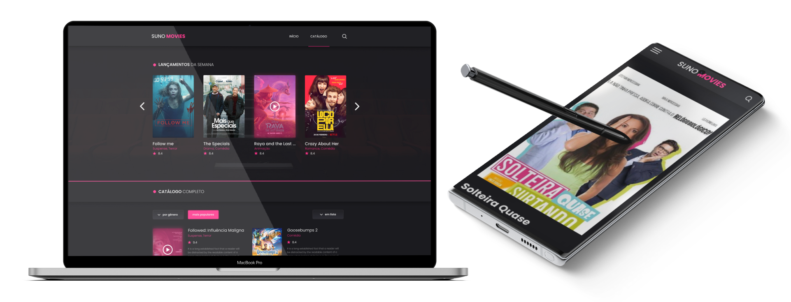

#### <a name="top"></a> <br><br>

<h5 align="center">
  <a href="https://suno-movies.vercel.app/" target="_blank">
    
  </a>
</h5>

<h5 align="center">🍿 Let's watch?</h5>

<p align="center">
  <a href="#gem">💎 Roadmap</a>&nbsp;&nbsp;&nbsp;|&nbsp;&nbsp;
  <a href="#flying_saucer">🛸 Techs</a>&nbsp;&nbsp;&nbsp;|&nbsp;&nbsp;
  <a href="#warning">⚠️ Prerequisites</a>&nbsp;&nbsp;&nbsp;|&nbsp;
  <a href="#grey_question">❔ How To Use</a>&nbsp;&nbsp;&nbsp;|&nbsp;&nbsp;
  <a href="#bookmark">🔖 Badges</a>&nbsp;&nbsp;&nbsp;|&nbsp;&nbsp;
  <a href="#closed_lock_with_key">🔐 License</a>&nbsp;&nbsp;&nbsp;|&nbsp;&nbsp;
  <a href="#phone">☎ Contact Me</a>
</p>

<br><br>

<p align="center">
  
</p>

<br>

#### <a name="gem"></a> <br>

## 💎 Roadmap <a href="#top"></a>


###### 📂 Header

<details open>
  <summary>🕹️<sup>🤏</sup></summary>

- [x] Show or hide header effect with scroll event
- [ ] Form input header search bar validation with Yup lib
- [x] Toggle form input header search bar with <kbd>Ctrl+Shift+f</kbd> shortcut
- [x] Close form input header search bar with <kbd>Escape</kbd> shortcut
- [x] Get auto focus input when form input header search bar is open
- [x] Search movie
- [x] Different header style between home and other pages
</details>

###### 📂 Header > mob

- [x] Open menu

###### 📂 Footer

- [x] Code repository anchor

###### 📃 Catalogue

<details open>
  <summary>🕹️<sup>🤏</sup></summary>

- [x] Scroll to the catalogue section
- [x] List movies
  - Carousel
    - Change carousel card movie scale/effect with mouse hover
  - Catalogue list
- [x] Filter buttons by:
  - Genre
  - Layout
  - Close filter accordion with outside element click
- [x] Load more button
</details>

###### 📃 Selected movie

<details open>
  <summary>🕹️<sup>🤏</sup></summary>

- [x] List movie details
- [x] Video player
  - [ ] Fix some movie id that doesn't work
  - Captions
  - Settings
  - TV share
  - Full screen
  - Watch on YouTube
  - ...
  </details>

###### 📃 404

- [x] Custom error page

###### ⚙️ Others

<details open>
  <summary>🕹️<sup>🤏</sup></summary>

- [x] Responsive layout
- [x] Back to top button
- [x] Save movie details data on browser local storage
- [ ] Toggle theme mode, Dark **default** | Light | Automatic
- [ ] Shimmer skeleton lazy loading placeholder
- [ ] Button loading
- [ ] Static Generation (SSG)
- _*Any suggestion?*_ <a href="#phone">Contact me!</a>
</details>

#### <a name="flying_saucer"></a> <br>

## 🛸 Techs <a href="#top"></a>

<table>
  <tr align="center">
    <th>dependencies</th>
    <th>devDependencies</th>
    <th>Others</th>
  </tr>

  <tr align="center">
    <td><a href="https://axios-http.com/">Axios</a></td>
    <td><a href="https://github.com/conventional-changelog/commitlint">Commitlint</a></td>
    <td><a href="https://chrome.google.com/webstore/detail/react-developer-tools/fmkadmapgofadopljbjfkapdkoienihi">React Developer Tools</a></td>
  </tr>
  <tr align="center">
    <td><a href="https://animate.style/">Animate.css</a></td>
    <td><a href="https://github.com/commitizen/cz-cli">Commitizen</a></td>
    <td><a href="https://code.visualstudio.com/docs/editor/debugging">Vs Code Debugger</a></td>
  </tr>
  <tr align="center">
    <td><a href="https://github.com/luukdv/hamburger-react">Hamburger-react</a></td>
    <td><a href="https://github.com/leoforfree/cz-customizable">CZ-customizable</a></td>
    <td><a href="#"></a></td>
  </tr>
  <tr align="center">
    <td><a href="https://ianlunn.github.io/Hover/">Hover.css</a></td>
    <td><a href="https://eslint.org/">ESLint</a></td>
    <td><a href="#"></a></td>
  </tr>
  <tr align="center">
    <td><a href="https://github.com/mifi/react-lottie-player">LottieFiles</a></td>
    <td><a href="https://github.com/Tibfib/eslint-plugin-import-helpers">ESlint-plugin-import-helpers</a></td>
    <td><a href="#"></a></td>
  </tr>
  <tr align="center">
    <td><a href="https://mui.com/pt/">Material UI</a></td>
    <td><a href="https://github.com/typicode/husky">Husky</a></td>
    <td><a href="#"></a></td>
  </tr>
    <tr align="center">
    <td><a href="https://vercel.com/solutions/nextjs">Next.js</a></td>
    <td><a href="https://prettier.io/">Prettier</a></td>
    <td><a href="#"></a></td>
  </tr>
  <tr align="center">
    <td><a href="https://polished.js.org/">Polished</a></td>
    <td><a href="https://react-svgr.com/">SVGR</a></td>
    <td><a href="#"></a></td>
  </tr>
  <tr align="center">
    <td><a href="https://pt-br.reactjs.org/">React</a></td>
    <td><a href="https://www.typescriptlang.org/">TypeScript</a></td>
    <td><a href="#"></a></td>
  </tr>
  <tr align="center">
    <td><a href="https://react-icons.github.io/react-icons">React-icons</a></td>
    <td><a href="#"></a></td>
    <td><a href="#"></a></td>
  </tr>
  <tr align="center">
    <td><a href="https://github.com/contra/react-responsive">React-responsive</a></td>
    <td><a href="#"></a></td>
    <td><a href="#"></a></td>
  </tr>
  <tr align="center">
    <td><a href="https://www.npmjs.com/package/react-multi-carousel">React-multi-carousel</a></td>
    <td><a href="#"></a></td>
    <td><a href="#"></a></td>
  </tr>
  <tr align="center">
    <td><a href="https://styled-components.com/">Styled-components</a></td>
    <td><a href="#"></a></td>
    <td><a href="#"></a></td>
  </tr>
  <tr align="center">
    <td><a href="https://vercel.com/">Vercel</a></td>
    <td><a href="#"></a></td>
    <td><a href="#"></a></td>
  </tr>
</table>

#### <a name="warning"></a> <br>

## ⚠️ Prerequisites <a href="#top"></a>

In order to use and test this project locally, you should've already setup the development environment. <br>
_Or go to [**suno-movies.vercel.app**](https://suno-movies.vercel.app/) to see the project in a production environment._

[](https://suno-movies.vercel.app/)

#### <a name="grey_question"></a> <br>

## ❔ How To Use <a href="#top"></a>

To clone and run this application locally, you'll need [Git](https://git-scm.com), [Node.js v10.16][nodejs] or higher + [Yarn v1.13][yarn] or higher installed on your computer.

<details open>
  <summary>Hit me to toggle collapse: 🕹️<sup>🤏</sup></summary>

_From your `command line` follow these steps..._

```bash
# Clone the project
$ git clone https://github.com/caiohenrique-developer/suno-movies.git 'Suno-Movies' && cd 'Suno-Movies'

# Install dependencies
$ yarn
# or
$ npm i

# Start the project
$ yarn dev

# You'll be able to see the URL http://localhost:{port} on your command line, so open them!

# Very well, now you can enjoy this project! ;)
```

</details>

#### <a name="bookmark"></a> <br>

## 🔖 Badges <a href="#top"></a>

<p align="center">
  

  

  <a href="https://github.com/caiohenrique-developer/suno-movies/commits/master">
    
  </a>

  <a href="https://github.com/caiohenrique-developer/suno-movies/issues">
    
  </a>

  

  

  

  

  

  

  

  

  

  

  
</p>

#### <a name="closed_lock_with_key"></a> <br>

## 🔐 License <a href="#top"></a>

Copyright © 2021 Suno Movies, [MIT](https://github.com/caiohenrique-developer/suno-movies/blob/master/LICENSE) .

###### _This project is under the <sup>MIT</sup> license. See the license for more information._

---

<blockquote align="center">“Always running in search of the goals!” <br> Done with ♥ by myself 👇 <a href="#-contact-me-phone">Get in touch!</a></blockquote>

#### <a name="phone"></a> <br>

## ☎ Contact Me <a href="#top"></a>

<p align="left">
  

  <br>

  <a href="mailto:caiohenrique.developer@gmail.com">
    
  </a>
  <a href="https://www.linkedin.com/in/caio-henrique-024627171">
    
  </a>
  <a href="https://discord.com/users/688203516967387177">
    
  </a>
  <a href="https://api.whatsapp.com/send?phone=5511943902438&text=Fala%20Caio,%20como%20vai?">
    
  </a>
</p>

[nodejs]: https://nodejs.org/
[yarn]: https://yarnpkg.com/
[vc]: https://code.visualstudio.com/
[vceditconfig]: https://marketplace.visualstudio.com/items?itemName=EditorConfig.EditorConfig
[vceslint]: https://marketplace.visualstudio.com/items?itemName=dbaeumer.vscode-eslint
[vcprettier]: https://prettier.io/
