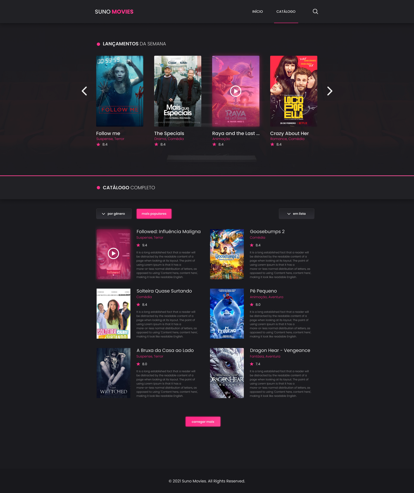

#### <a name="top"></a> <br><br>

<h5 align="center">
  <a href="https://suno-movies.vercel.app/" target="_blank">
    
  </a>
</h5>

<h5 align="center">🍿 Let's watch?</h5>

<p align="center">
  <a href="#gem">💎 Roadmap</a>&nbsp;&nbsp;&nbsp;|&nbsp;&nbsp;
  <a href="#flying_saucer">🛸 Techs</a>&nbsp;&nbsp;&nbsp;|&nbsp;&nbsp;
  <a href="#warning">⚠️ Prerequisites</a>&nbsp;&nbsp;&nbsp;|&nbsp;
  <a href="#grey_question">❔ How To Use</a>&nbsp;&nbsp;&nbsp;|&nbsp;&nbsp;
  <a href="#bookmark">🔖 Badges</a>&nbsp;&nbsp;&nbsp;|&nbsp;&nbsp;
  <a href="#closed_lock_with_key">🔐 License</a>&nbsp;&nbsp;&nbsp;|&nbsp;&nbsp;
  <a href="#phone">☎ Contact Me</a>
</p>

<br><br>

<p align="center">
  
</p>

<br>

#### <a name="gem"></a> <br>

## 💠Roadmap <a href="#top"></a>


- [ ] ...
- Any suggestion?
  - <a href="#-contact-me-phone">Contact me!</a>

#### <a name="flying_saucer"></a> <br>

## 🛸 Techs <a href="#top"></a>

<table>
  <tr align="center">
    <th>dependencies</th>
    <th>devDependencies</th>
  </tr>

  <tr align="center">
    <td><a href="https://vercel.com/solutions/nextjs">Next.js</a></td>
    <td><a href="https://github.com/conventional-changelog/commitlint">Commitlint</a></td>
  </tr>
  <tr align="center">
    <td><a href="https://reactjs.org/">ReactJS</a></td>
    <td><a href="https://github.com/commitizen/cz-cli">Commitizen</a></td>
  </tr>
  <tr align="center">
    <td><a href="https://styled-components.com/">Styled-components</a></td>
    <td><a href="https://github.com/typicode/husky">Husky</a></td>
  </tr>
  <tr align="center">
    <td><a href="#"></a></td>
    <td><a href="https://eslint.org/">ESLint</a></td>
  </tr>
  <tr align="center">
    <td><a href="#"></a></td>
    <td><a href="https://prettier.io/">Prettier</a></td>
  </tr>
  <tr align="center">
    <td><a href="#"></a></td>
    <td><a href="https://editorconfig.org/">EditorConfig</a></td>
  </tr>
  <tr align="center">
    <td><a href="#"></a></td>
    <td><a href="https://www.typescriptlang.org/">TypeScript</a></td>
  </tr>
</table>

#### <a name="warning"></a> <br>

## ⚠️ Prerequisites <a href="#top"></a>

In order to use and test this project locally, you should've already setup the development environment. <br>
_Or go to [**suno-movies.vercel.app**](https://suno-movies.vercel.app/) to see the project in a production environment._

[](https://suno-movies.vercel.app/)

#### <a name="grey_question"></a> <br>

## ❔ How To Use <a href="#top"></a>

To clone and run this application locally, you'll need [Git](https://git-scm.com), [Node.js v10.16][nodejs] or higher + [Yarn v1.13][yarn] or higher installed on your computer.

<details open>
  <summary>Hit me to toggle collapse: 🕹️<sup>🤏</sup></summary>

_From your `command line` follow these steps..._

```bash
# Clone the project
$ git clone https://github.com/caiohenrique-developer/suno-movies.git 'Suno-Movies' && cd 'Suno-Movies'

# Install dependencies
$ yarn
# or
$ npm i

# Start the project
$ yarn dev

# Very well, now you can enjoy this project! ;)
```

</details>

#### <a name="bookmark"></a> <br>

## 🔖 Badges <a href="#top"></a>

<p align="center">
  

  

  <a href="https://www.codacy.com/app/caiohenrique-developer/suno-movies?utm_source=github.com&amp;utm_medium=referral&amp;utm_content=caiohenrique-developer/suno-movies&amp;utm_campaign=Badge_Grade">
    
  </a>

  <a href="https://github.com/caiohenrique-developer/suno-movies/commits/master">
    
  </a>

  <a href="https://github.com/caiohenrique-developer/suno-movies/issues">
    
  </a>

  

  

  

  

  

  

  

  

  

  

  
</p>

#### <a name="closed_lock_with_key"></a> <br>

## 🔠License <a href="#top"></a>

Copyright © 2021 Suno Movies, [MIT](https://github.com/caiohenrique-developer/suno-movies/blob/master/LICENSE) .

###### _This project is under the <sup>MIT</sup> license. See the license for more information._

---

<blockquote align="center">“Always running in search of the goals!” <br> Done with ♥ by myself 👇 <a href="#-contact-me-phone">Get in touch!</a></blockquote>

#### <a name="phone"></a> <br>

## ☠Contact Me <a href="#top"></a>

<p align="left">
  

  <br>

  <a href="mailto:caiohenrique.developer@gmail.com">
    
  </a>
  <a href="https://www.linkedin.com/in/caio-henrique-024627171">
    
  </a>
  <a href="https://discord.com/users/688203516967387177">
    
  </a>
  <a href="https://api.whatsapp.com/send?phone=5511943902438&text=Fala%20Caio,%20como%20vai?">
    
  </a>
</p>

[nodejs]: https://nodejs.org/
[yarn]: https://yarnpkg.com/
[vc]: https://code.visualstudio.com/
[vceditconfig]: https://marketplace.visualstudio.com/items?itemName=EditorConfig.EditorConfig
[vceslint]: https://marketplace.visualstudio.com/items?itemName=dbaeumer.vscode-eslint
[vcprettier]: https://prettier.io/
